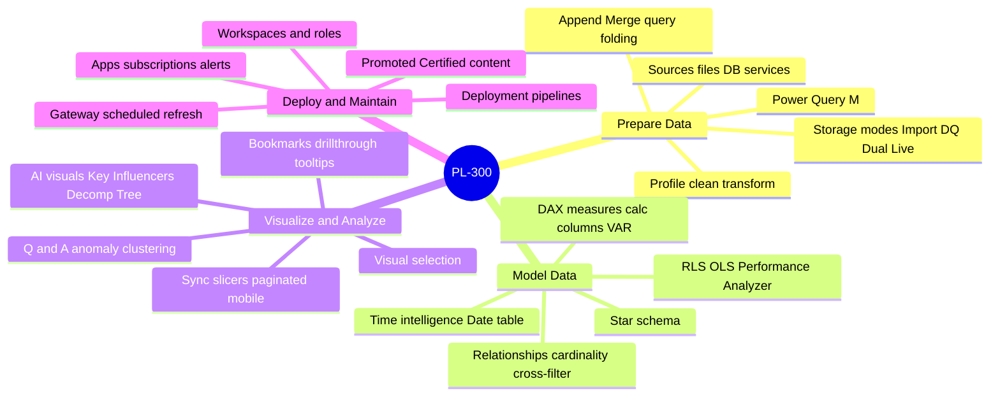
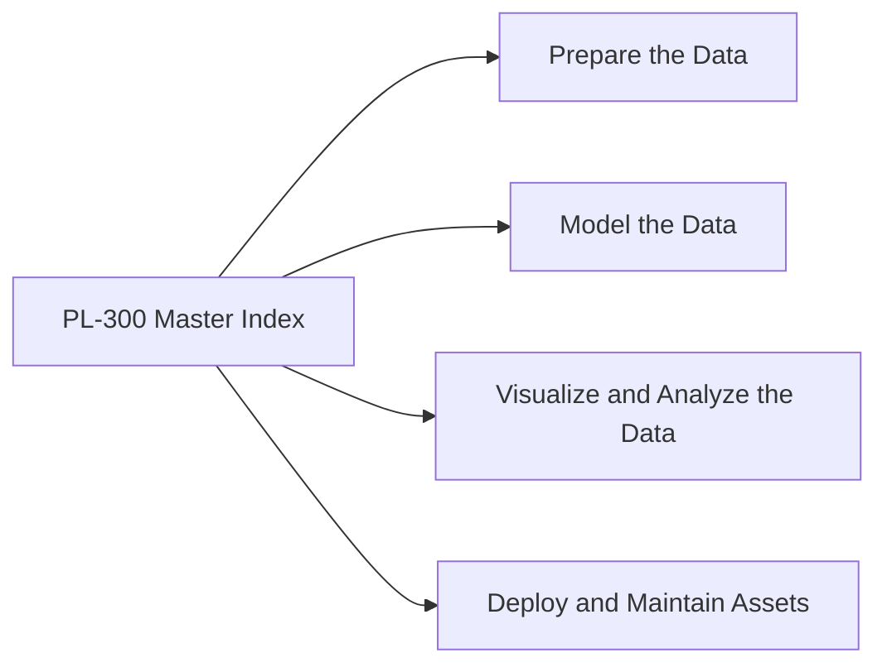
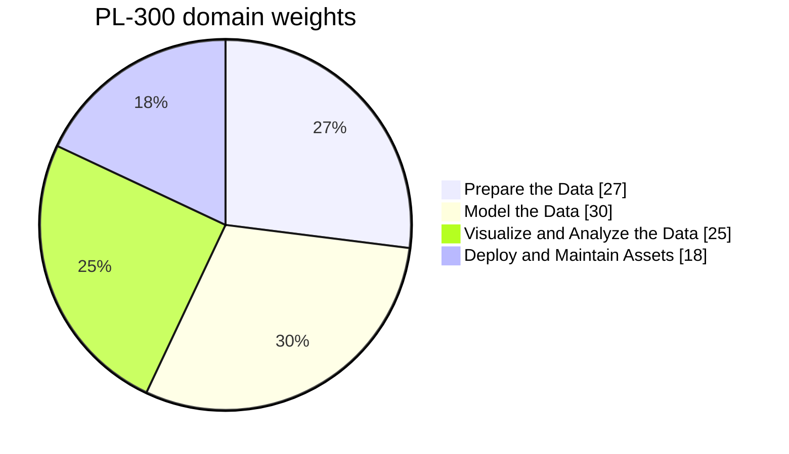

# PL-300 - Microsoft Power BI Data Analyst Associate - Visual Study Guide

> Concept-only study aid. No exam questions reproduced. Source PDF (if any) stays local + gitignored.

**Skills outline:** https://learn.microsoft.com/credentials/certifications/resources/study-guides/pl-300

## Concept mindmap

## Domain map

## Domain weights

> Click a slice / legend label to jump to that chapter.

## Recommended study order

```mermaid
gantt
    title Suggested study plan
    dateFormat X
    axisFormat Day %d
    section Plan
    Prepare the Data :t1, 0, 1d
    Model the Data :t2, after t1, 2d
    Visualize and Analyze the Data :t3, after t2, 1d
    Deploy and Maintain Assets :t4, after t3, 1d
```

---

**Next:** open [01-prepare-data.md](01-prepare-data.md)

<!-- TODO: fill remaining sections via Copilot chat. Target structure mirrors c:\az305\study-guide\00-MASTER-INDEX.md. -->
