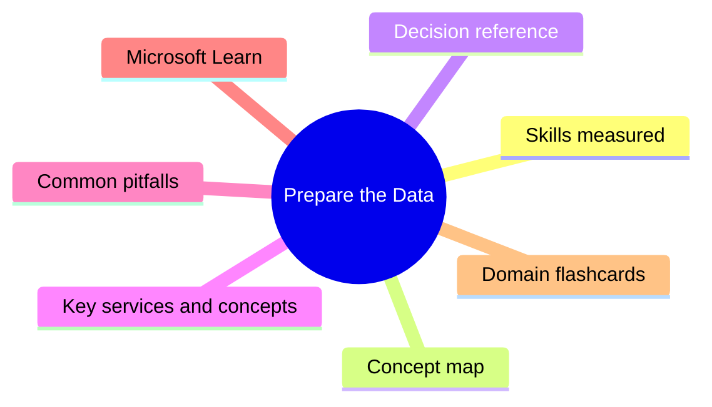

# Prepare the Data

**Domain weight on the exam:** ~27% (for PL-300).


## Domain mind map



## Skills measured

- Get data from data sources: identify source, change settings (data source, storage mode, gateway), select shared semantic model or create local model, choose between DirectQuery, Import, Dual.
- Clean the data: evaluate column statistics, resolve inconsistent / unexpected / null values, resolve data import errors.
- Transform and load data in Power Query: apply user-friendly value replacements, profile data, identify and create appropriate keys for joins, evaluate and transform column data types, shape and transform tables, combine queries (append, merge), apply user-friendly naming conventions, configure data loading, resolve Power Query performance issues.

## Concept map

```mermaid
flowchart TD
  DataSources[Prepare the Data]
  DataSources --> StorageModes[Import / DirectQuery / Dual / Live]
  DataSources --> PowerQuery[M-language ETL editor]
  DataSources --> Profiling[Stats + quality + distribution]
  DataSources --> Combine[Append (UNION) + Merge (JOIN)]
```

## Decision reference

| Use this | When |
| --- | --- |
| **Import mode** | Data fits in memory, fast queries, refresh schedule |
| **DirectQuery** | Real-time, very large data, source supports it |
| **Dual** | Composite model - mix import + DQ tables, optimize joins |
| **Live Connection** | Connect to Azure Analysis Services or shared semantic model (no local model) |
| **Append** | Stack rows from same-schema tables (UNION ALL) |
| **Merge** | Join columns from related tables (LEFT/INNER/etc) |
| **On-premises data gateway (Standard)** | Enterprise gateway, shared, multi-source |
| **Personal gateway** | Single user, only for Import refresh, no DQ |

## Key services and concepts

| Name | Role |
| --- | --- |
| **Power Query Editor** | ETL workspace using M language |
| **Power BI Desktop** | Authoring tool for reports + semantic models |
| **Storage modes** | Import / DirectQuery / Dual / Live |
| **Composite model** | Mix Import + DirectQuery in one model |
| **Data profiling** | Column stats, distribution, quality views |
| **On-prem data gateway** | Bridge cloud Power BI service to on-prem sources |
| **Shared semantic model** | Centrally certified dataset for many reports (formerly 'shared dataset') |
| **Append queries** | Stack rows of identical schemas |
| **Merge queries** | Join two tables on key columns |
| **Query folding** | Push transforms back to the source as SQL - improves perf |

## Common pitfalls

- Breaking query folding by using non-foldable steps (Index, Add Column with M function) - performance collapses.
- Choosing DirectQuery for huge models then writing complex DAX that times out at the source.
- Forgetting that DirectQuery has limited DAX functions and modeling restrictions.
- Using personal gateway in production - it stops when the user logs out.
- Loading text columns as type 'Any' - blocks query folding and breaks summaries.

## Microsoft Learn

- [Get data in Power BI](https://learn.microsoft.com/training/modules/get-data-power-bi/)
- [Clean, transform, and load data in Power BI](https://learn.microsoft.com/training/modules/clean-data-power-bi/)
- [Query folding in Power Query](https://learn.microsoft.com/power-query/power-query-folding)
- [Composite models in Power BI](https://learn.microsoft.com/power-bi/transform-model/desktop-composite-models)

## Domain flashcards

<section class="fc-section" data-fc-title="Prepare the Data quick-fire">
<div class="flashcard-grid">
<div class="flashcard"><div class="fc-q">Q: When pick DirectQuery over Import?</div><div class="fc-a">A: When data is very large, must be real-time, and source supports DQ - accept perf trade-off.</div></div>
<div class="flashcard"><div class="fc-q">Q: What is query folding?</div><div class="fc-a">A: Power Query pushes M transformations back to the source as a single SQL query.</div></div>
<div class="flashcard"><div class="fc-q">Q: Append vs Merge?</div><div class="fc-a">A: Append stacks rows (UNION); Merge joins columns from related tables.</div></div>
<div class="flashcard"><div class="fc-q">Q: When use Dual storage mode?</div><div class="fc-a">A: In composite models for small dimension tables that may join to either Import or DQ fact tables.</div></div>
<div class="flashcard"><div class="fc-q">Q: Personal vs Standard gateway?</div><div class="fc-a">A: Personal = single user, Import only, sleeps when user logs out. Standard = enterprise, multi-user, supports DQ + Live.</div></div>
<div class="flashcard"><div class="fc-q">Q: Why profile a column?</div><div class="fc-a">A: Spot data quality issues (errors, empties), distribution, distinct values - before modeling.</div></div>
</div>
</section>
