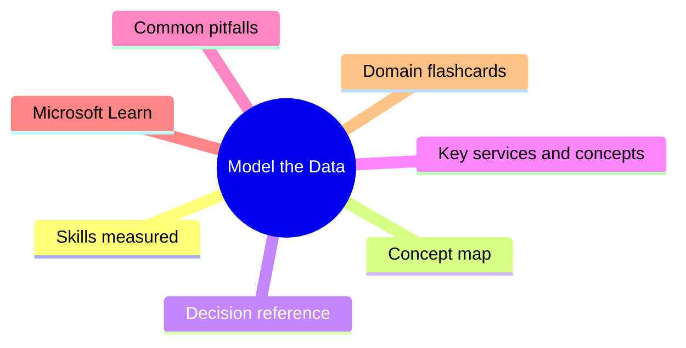
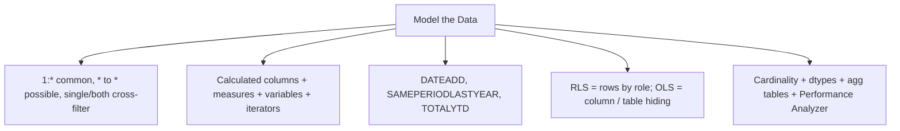

# Model the Data

**Domain weight on the exam:** ~30% (for PL-300).

## Domain mind map

## Skills measured

- Design and implement a data model: configure table and column properties, implement role-playing dimensions, define a relationship's cardinality and cross-filter direction, create a common date table, implement row-level security (RLS) and object-level security (OLS).
- Create model calculations using DAX: create single aggregation measures, time intelligence calculations (YTD, prior year, MoM), implement iterators (SUMX, AVERAGEX), categorical labels with calculated columns, implement what-if parameters, variables, error handling.
- Optimize model performance: improve performance by identifying and removing unnecessary rows and columns, identify poorly performing measures/relationships/visuals using Performance Analyzer, improve performance by choosing optimal data types, summarize data with aggregations.

## Concept map

## Decision reference

| Use this | When |
| --- | --- |
| **Calculated column** | Per-row computation, materialized at refresh, slicing/filtering |
| **Measure** | Aggregate across rows on the fly, dynamic by filter context |
| **Calculated table** | Materialized table from DAX expression (less common) |
| **RLS** | Hide rows based on user role (UserPrincipalName) |
| **OLS** | Hide entire columns / tables based on role (sensitive PII) |
| **Single direction cross-filter** | Default; dim -> fact |
| **Both directions** | Use sparingly; needed for many-to-many bridge |
| **Role-playing dim (Date)** | Make multiple inactive relationships + USERELATIONSHIP, or duplicate dim |

## Key services and concepts

| Name | Role |
| --- | --- |
| **Star schema** | Recommended modeling pattern - fact in center, dims radiating |
| **Relationship** | Connection between tables; cardinality 1:* most common |
| **Cross-filter direction** | Single (default) or Both |
| **Row-Level Security (RLS)** | Filter rows by role using DAX filter expressions |
| **Object-Level Security (OLS)** | Hide columns/tables by role (Tabular Editor) |
| **Calculated column** | Computed per row, stored in model |
| **Measure** | Dynamic aggregation based on filter context |
| **Variable (VAR)** | Compute once, reuse - readability + perf |
| **Time intelligence** | Functions over a Date table - TOTALYTD, SAMEPERIODLASTYEAR, DATEADD |
| **Iterator function** | SUMX/AVERAGEX/MAXX - row-by-row evaluation |
| **Aggregation table** | Pre-summarized table accelerating queries |
| **Performance Analyzer** | Built-in tool measuring visual + DAX + query times |

## Common pitfalls

- Using bidirectional cross-filter everywhere - causes ambiguity + bad perf.
- Calculated columns where measures would do (bloats model + RAM).
- Forgetting a Date table - time intelligence breaks without one.
- Naming measures the same as columns - confusing in formula bar.
- Using FILTER inside CALCULATE where simple Boolean predicate works - slower.
- Storing high-cardinality numeric columns as text - destroys compression.

## Microsoft Learn

- [Design a data model in Power BI](https://learn.microsoft.com/training/modules/design-model-power-bi/)
- [Add measures to Power BI Desktop models](https://learn.microsoft.com/training/modules/dax-power-bi-add-measures/)
- [Work with DAX time intelligence](https://learn.microsoft.com/training/modules/dax-power-bi-time-intelligence/)
- [Optimize a model for performance](https://learn.microsoft.com/training/modules/optimize-model-power-bi/)
- [Configure row-level security](https://learn.microsoft.com/training/modules/row-level-security-power-bi/)

## Domain flashcards

<section class="fc-section" data-fc-title="Model the Data quick-fire">

Q: Calculated column vs measure?

A: Calculated column is per-row, stored, good for slicing. Measure is dynamic aggregation, computed at query time.

Q: Why a dedicated Date table?

A: Time intelligence functions require continuous, marked date table. Lets you filter across multiple fact tables.

Q: RLS vs OLS?

A: RLS hides rows by role; OLS hides entire columns/tables by role.

Q: When use VAR in DAX?

A: To compute a value once and reuse - improves readability AND perf.

Q: Cross-filter direction default?

A: Single (from dim 'one' side to fact 'many' side).

Q: Star schema benefit?

A: Simpler model, better compression, single direction filtering, faster queries.

Q: How implement role-playing date dim?

A: Multiple inactive relationships + USERELATIONSHIP() in measures, OR duplicate the Date table.

</section>
