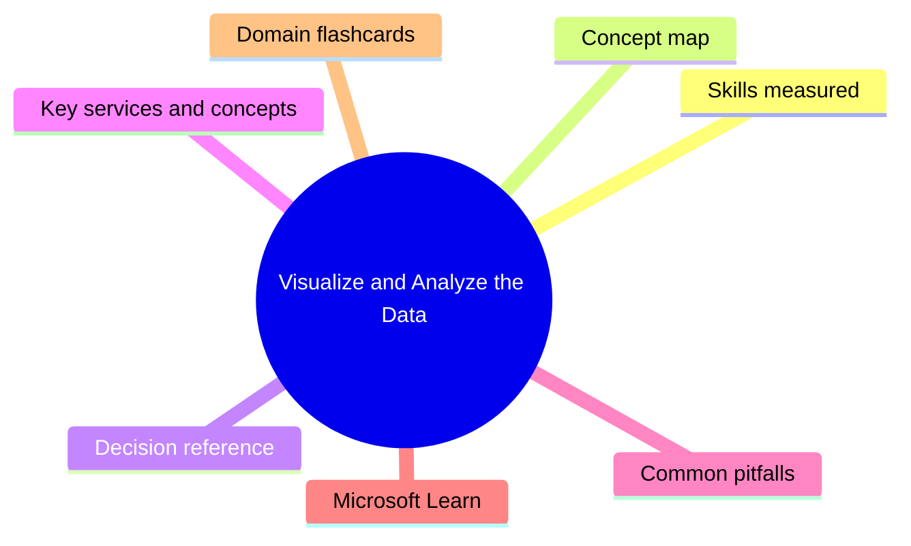
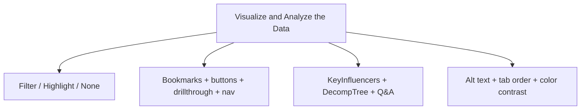

# Visualize and Analyze the Data

**Domain weight on the exam:** ~25% (for PL-300).

## Domain mind map

## Skills measured

- Create reports: identify and implement appropriate visualizations, format and configure visualizations, use a custom visual, apply and customize a theme, configure conditional formatting, apply slicing and filtering, configure the report page, drillthrough, tooltips, bookmarks, sync slicers, design reports for accessibility, configure automatic page refresh, create a paginated report.
- Enhance reports for usability and storytelling: configure bookmarks, create custom tooltips, edit and configure interactions between visuals, configure navigation for a report, apply sorting, configure sync slicers, group and layer visuals by using selection pane, drillthrough across pages, configure export of report content, design reports for mobile devices.
- Identify patterns and trends: use AI visuals (Key Influencers, Decomposition Tree, Q&A), use grouping, binning, clustering, use statistical summaries and anomaly detection, identify outliers, conduct time series analysis, use the Analyze feature in Power BI service.

## Concept map

## Decision reference

| Use this | When |
| --- | --- |
| **Bar/column chart** | Compare categories |
| **Line chart** | Trend over continuous axis (time) |
| **Stacked column** | Part-to-whole over categories |
| **Pie/donut** | Few categories, part-of-whole (avoid >5 slices) |
| **Scatter** | Two measures, correlation, outliers |
| **Card/multi-row card** | Single KPI or small set of KPIs |
| **Matrix** | Rows + columns with totals (pivot) |
| **Map** | Geo distribution |
| **Key Influencers** | Find what drives a metric up/down |
| **Decomposition Tree** | AI-powered breakdown of measure |
| **Drillthrough** | Right-click visit detail page filtered by selection |
| **Bookmark** | Save view state (filters, selection, visibility) |
| **Paginated report** | Print-ready, multi-page (RDL), fixed layout |

## Key services and concepts

| Name | Role |
| --- | --- |
| **Power BI Desktop** | Author reports |
| **Power BI service** | Publish + share + Q&A |
| **Mobile layout** | Separate portrait layout for phones |
| **Bookmarks** | Capture visible state - selections, filters, slide-deck navigation |
| **Drillthrough** | Pass selection to detail page |
| **Sync slicers** | Mirror slicer selections across pages |
| **Conditional formatting** | Color cells/bars/data labels by rule |
| **Themes** | JSON-controlled styling across report |
| **Q&A** | Natural language query |
| **Key Influencers** | AI visual identifying drivers |
| **Decomposition Tree** | AI visual breaking measure by dimensions |
| **Anomaly detection** | Built-in time-series outlier flagging |
| **Paginated reports** | RDL-based, multi-page printable - via Power BI Report Builder |

## Common pitfalls

- Using pie chart with >5 categories - unreadable.
- Forgetting to set tab order for accessibility.
- Mixing too many visual types on one page - cognitive overload.
- Using interactive reports for compliance prints - choose paginated instead.
- Adding custom visuals from untrusted publishers - security risk.
- Not testing the mobile layout.

## Microsoft Learn

- [Design Power BI reports](https://learn.microsoft.com/training/modules/design-effective-reports-power-bi/)
- [Enhance reports with interaction](https://learn.microsoft.com/training/modules/enhance-power-bi-report-interaction/)
- [Identify patterns and trends](https://learn.microsoft.com/training/modules/perform-analytics-power-bi/)
- [Apply AI insights in Power BI](https://learn.microsoft.com/training/modules/apply-ai-insights-power-bi/)

## Domain flashcards

<section class="fc-section" data-fc-title="Visualize and Analyze the Data quick-fire">

Q: Best visual for trend over time?

A: Line chart.

Q: Best AI visual to identify what drives a KPI?

A: Key Influencers.

Q: Paginated vs interactive reports?

A: Paginated = multi-page, print-ready, RDL, fixed layout. Interactive = visuals, slicers, drillthrough.

Q: How let users print full multi-page list?

A: Use a paginated report (Power BI Report Builder).

Q: Sync slicer purpose?

A: One slicer affects multiple report pages.

Q: Drillthrough use?

A: Right-click to navigate to a detail page filtered by selection context.

</section>
