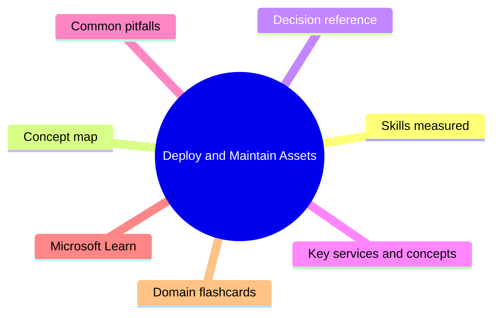
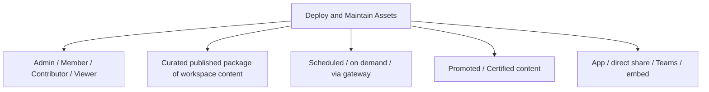

# Deploy and Maintain Assets

**Domain weight on the exam:** ~18% (for PL-300).

## Domain mind map

## Skills measured

- Create and manage workspaces and assets: create and configure a workspace, assign workspace roles, configure and update a workspace app, publish, import or update assets in a workspace, create dashboards, configure subscriptions and data alerts, promote or certify Power BI content, manage global options for files.
- Manage semantic models: identify when a gateway is required, configure a semantic model scheduled refresh, configure row-level security group membership, provide access to semantic models.

## Concept map

## Decision reference

| Use this | When |
| --- | --- |
| **Admin role** | Full control incl. user mgmt |
| **Member role** | Manage content + add others (not Admins) |
| **Contributor role** | Create/edit content, no sharing |
| **Viewer role** | Read only |
| **Workspace app** | Polished curated experience for many users |
| **Direct share** | Quick share to specific user/group |
| **Promoted content** | Owner indicates 'good content' |
| **Certified content** | Tenant admin endorses as trusted |
| **Standard gateway** | Cloud service connecting to on-prem sources - shared, prod |
| **Data alert** | Notify when card/KPI tile crosses threshold |

## Key services and concepts

| Name | Role |
| --- | --- |
| **Workspace** | Collaboration container for assets |
| **Workspace roles** | Admin/Member/Contributor/Viewer |
| **Apps** | Published curated content set to end users |
| **Dashboards** | Pinned visuals from one or more reports |
| **Subscriptions** | Email report/dashboard on schedule |
| **Data alerts** | Threshold notifications on dashboard tiles |
| **Scheduled refresh** | Periodic dataset refresh (Pro: 8x/day, PPU/Premium: 48x/day) |
| **Gateway** | Connect cloud service to on-prem data |
| **Promoted / Certified** | Endorsement signals for shared semantic models |
| **Deployment pipelines (Premium/PPU)** | Dev -> Test -> Prod release management |

## Common pitfalls

- Sharing content via 'Member of workspace' instead of an App - end users see edit clutter.
- Not setting refresh credentials after dataset ownership change - refresh fails.
- Configuring RLS in Desktop but forgetting to add users to role groups in the service.
- Promoting content from random workspaces - lose lineage governance.
- Using personal gateway for prod - stops when user is offline.
- Not separating dev/test/prod workspaces; one bad change breaks consumers.

## Microsoft Learn

- [Create workspaces in Power BI](https://learn.microsoft.com/training/modules/create-power-bi-team-workspace/)
- [Manage datasets in Power BI](https://learn.microsoft.com/training/modules/manage-datasets-power-bi/)
- [Configure scheduled refresh](https://learn.microsoft.com/power-bi/connect-data/refresh-scheduled-refresh)
- [Deployment pipelines](https://learn.microsoft.com/power-bi/create-reports/deployment-pipelines-overview)

## Domain flashcards

<section class="fc-section" data-fc-title="Deploy and Maintain Assets quick-fire">

Q: Four workspace roles?

A: Admin, Member, Contributor, Viewer.

Q: App vs workspace direct share?

A: App = curated, polished experience for many end users; workspace = creator/collab space.

Q: Max scheduled refreshes Pro vs Premium/PPU?

A: Pro 8/day. Premium/PPU 48/day.

Q: When need an on-prem data gateway?

A: When dataset source is behind a firewall (on-prem SQL/files) - for both refresh and DirectQuery.

Q: Promoted vs Certified content?

A: Promoted = owner says it's good. Certified = tenant admin/data steward formally endorses.

Q: How separate dev / test / prod in Power BI?

A: Use deployment pipelines (Premium/PPU).

</section>
