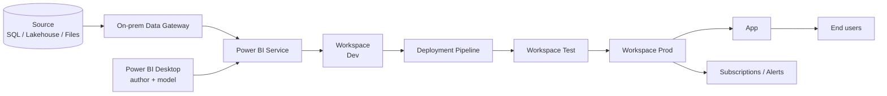

# Reference architectures (PL-300)

A canonical wire-up of the major services.

```mermaid
flowchart LR
  src[(Source<br/>SQL / Lakehouse / Files)] --> gw[On-prem Data Gateway]
  gw --> svc[Power BI Service]
  Author[Power BI Desktop<br/>author + model] --> svc
  svc --> ws[Workspace<br/>Dev]
  ws --> pipe[Deployment Pipeline]
  pipe --> wsT[Workspace Test] --> wsP[Workspace Prod]
  wsP --> app[App]
  app --> users[End users]
  wsP --> sub[Subscriptions / Alerts]
```
